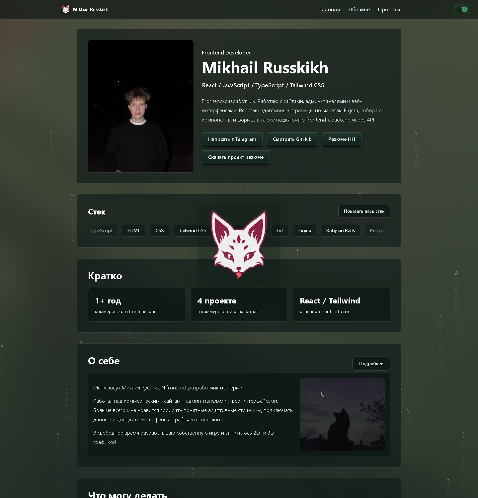
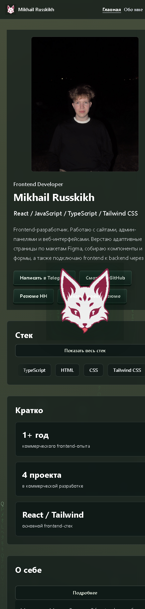
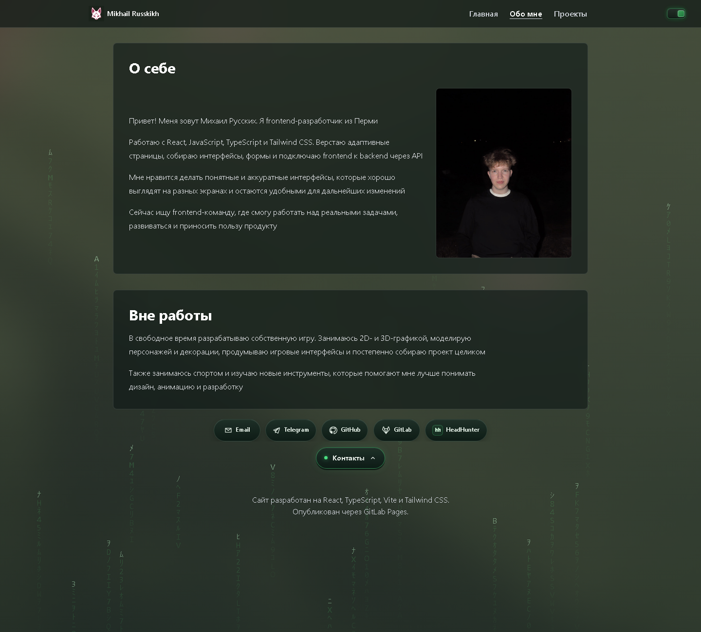
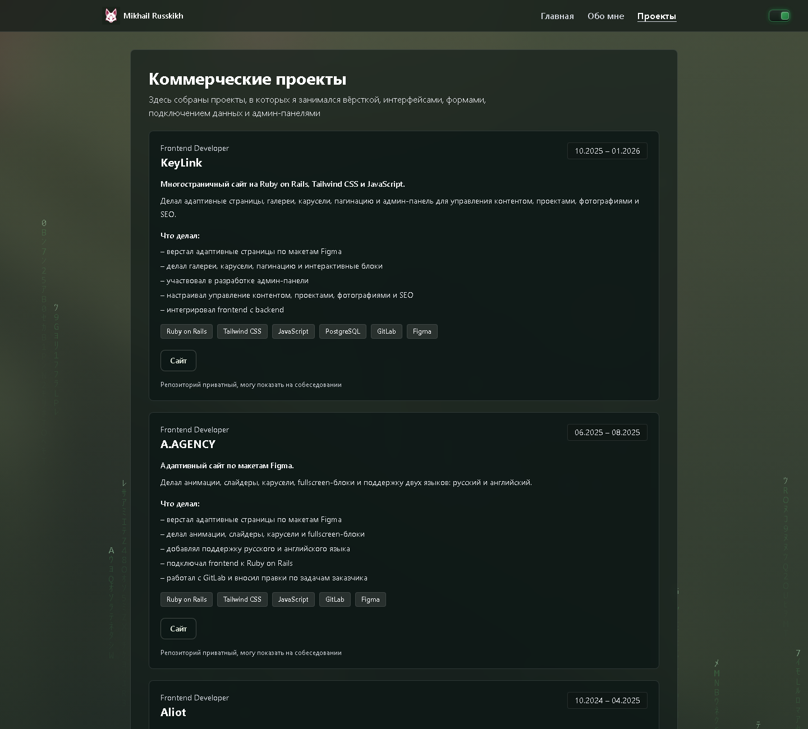

# Михаил Русских — Frontend Developer

[](https://deazi-c87e25.gitlab.io/)
[](https://deazi-c87e25.gitlab.io/)

Личное портфолио: проекты, опыт, технологии и контакты.

### [Открыть портфолио →](https://deazi-c87e25.gitlab.io/)


## Скриншоты

### Главная

<p>
  
</p>

### Мобильная версия

<p>
  
</p>

### Обо мне

<p>
  
</p>

### Опыт

<p>
  
</p>

## Стек

`TypeScript` · `Vite` · `Tailwind CSS` · `HTML` · `CSS`

## В портфолио

- проекты с live demo и исходным кодом;
- опыт и используемые технологии;
- контакты и резюме.

## Локальный запуск

```bash
npm install
npm run dev
```

---

**Live:** https://deazi-c87e25.gitlab.io/